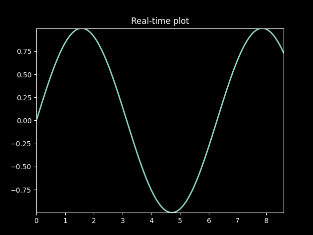

# nixplot: A real-time graphing tool for \*nix systems
<p>
<a href="doc/demo.gif">
  
</a>   

_nixplot_ is inspired by the UNIX philosophy,  'Make each program do one thing well'. _nixplot_ gets data from stdin and plots it in real time. _nixplot_ can also plot data from files. This can have several potential use cases:
- Plotting dynamic stock prices in real time
- Visualizing real-time network packet latencies

All you need is a process spitting out data to stdout!

## Requirements
_nixplot_ is written in python3. It uses matplotlib version 3.4.1.

## Usage
_nixplot_ is meant to take graphing input data as and when it is dynamically produced. When used with classic UNIX utilities such as _awk_ and _sed_, it is very easy to visualize dynamic statistics with minimal effort.

To test _nixplot_:
```shell
$ ./nixplot test/data/sin.txt
$ #OR
$ ./nixplot < test/data/sin.txt
$ #OR
$ ./test/script/sin.py | ./nixplot 
```

## TODOs
- a configuration framework to change hardcoded parameters. Maybe TOML?
- option to save input data to a log
- multiple graphs plotted live
- event driven UI?

## License
This repository is licenced under `MIT Licence`
